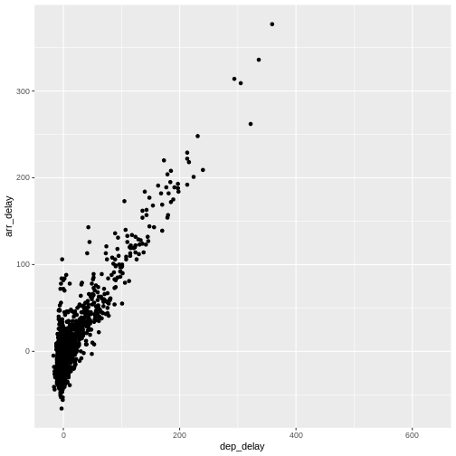

::::questions
  - "How do I make a Boxplot?"
  - "How do I make a linear regression?"
::::

::::objectives
  - "Learn how to visualise the distribution of your data using boxplots"
  - "Learn how to investigate correlations between variables using linear regressions"
::::  
  


## Boxplots 

Boxplots are a common way of quickly visualizing some summary statistics for different groups in our data. 

For this example, we use air_time, the time the flight takes, instead of
departure delays. 


``` r
flightdata %>% 
  left_join(carriers) %>% relocate(name, .after = carrier) %>% 
  ggplot(mapping = aes(x = name, y = air_time)) + 
  geom_boxplot() + 
  coord_flip()
```

``` output
Joining with `by = join_by(carrier)`
```

``` warning
Warning: Removed 9430 rows containing non-finite outside the scale range
(`stat_boxplot()`).
```


The boxplots show the inter quartile range with the white box. The solid black
line within that, is the median of the air_time. The horizontal lines, called
whiskers, on each
side of the white box shows the "minimum" and "maximum" observations, defined
as the observations that lies no longer from the IQR than 1.5 of the IQR. 

The solid dots at each end of the boxplot, represents outliers, observations that 
lies outside the whiskers.

Depending on the data, and the nature of the analyses we are going to do,
outliers are either very interesting, or something that we can ignore.

In this case it might be interesting to investigate which destinations Hawaiian
Airlines serve. Their fligts are much longer than the flights of the rest of 
the airlines. 

Let us take a look:

``` r
flightdata %>% 
  left_join(carriers) %>% relocate(name, .after = carrier) %>% 
  filter(name == "Hawaiian Airlines Inc.") %>% 
  count(dest)
```

``` output
Joining with `by = join_by(carrier)`
```

``` output
# A tibble: 1 × 2
  dest      n
  <chr> <int>
1 HNL     342
```
The `count()` function counts the number of times a value exists in a given 
column, in this case `dest`. 

Conclusion: Hawaiian Airlines only flies to Honolulu. 

Which airlines flies to Honolulu?


``` r
flightdata %>% 
  left_join(carriers) %>% relocate(name, .after = carrier) %>%
  filter(dest == "HNL") %>% 
  count(name)
```

``` output
Joining with `by = join_by(carrier)`
```

``` output
# A tibble: 2 × 2
  name                       n
  <chr>                  <int>
1 Hawaiian Airlines Inc.   342
2 United Air Lines Inc.    365
```
Here we filter in order to only have flights to Honolulu, and 
then count the different airlines. Only United Air Lines and Hawaiian 
Airlines have fligths to Honolulu.

This also reveals, that the "outliers" for United Air Lines at the 
extreme right of the plot are not really outliers. They appear because these are the flights to Honolulu. The representation of the data implies that there are a lot of outliers from one single distribution of airtime for United Air Lines. But in reality, the airtime for UA is a bimodal distribution.


## Boxplots are not necessarily a good idea

The boxplots of the air_time indicates that there is more structure in the 
data than boxplots can reveal. Maybe we should look at the distribution of
airtime amongst the airlines.

We could plot histograms of the airtime for each airline. Or we could plot
the smoothed histograms we saw in the correllograms for each airline. Or
we can use an extra package, `ggridges` to do something fancy.

Begin by installing the package:

``` r
install.packages("ggridges")
```

Then load the package, and plot the data:

``` r
library(ggridges)

flightdata %>% 
  left_join(carriers) %>% relocate(name, .after = carrier) %>% 
ggplot(aes(x = air_time, y = name, fill = name)) +
  geom_density_ridges() +
  theme(legend.position = "none")
```

``` output
Joining with `by = join_by(carrier)`
Picking joint bandwidth of 5.42
```

``` warning
Warning: Removed 9430 rows containing non-finite outside the scale range
(`stat_density_ridges()`).
```


The number of flights United Air Lines have to Hawaii is too low to actually see here. But we do get a more nuanced view of the distribution of airtime for the individual airlines than we do using boxplots.

## What about a linear regression?

We saw earlier, that there was a correlation between departure delay and arrival delay. Can we use the data to predict how delayed we will be upon
arrival, when we know that the departure was 47 minutes delayed.

First, the plot:

``` r
flightdata %>%
  sample_frac(0.005) %>% 
  ggplot(mapping = aes(x = dep_delay, y = arr_delay)) +
  geom_point() 
```

``` warning
Warning: Removed 44 rows containing missing values or values outside the scale range
(`geom_point()`).
```


This looks more or less linear. We can place a linear regression line in the plot
using the function `geom_smooth(method = "lm")`, where we specify that the function
should fit a linear line to the data.


``` r
flightdata %>%
  sample_frac(0.005) %>% 
  ggplot(mapping = aes(x = dep_delay, y = arr_delay)) +
  geom_point() +
  geom_smooth(method = "lm")
```

``` output
`geom_smooth()` using formula = 'y ~ x'
```


So, what is the actual linear model of this data?

A linear model in this case would be a formula on the form:

$arr_{delay} = a\cdot dep_{delay} + b$

The task is now to find the values of `a` and `b` that best fit the data. This is
called "fitting a linear model". 

Fitting a linear model to data is done using the `lm()` function.

We need to specify the actual model that we want to fit, using the special
formula notation in R:

arr_delay ~ dep_delay

In addition we have to specify the input data in the function:


``` r
model <- lm(arr_delay ~ dep_delay, data = flightdata)
```

We do this on the entire dataset without any problems.

Let us take a look at the result:

``` r
model
```

``` output

Call:
lm(formula = arr_delay ~ dep_delay, data = flightdata)

Coefficients:
(Intercept)    dep_delay  
     -5.899        1.019  
```
We will not spend time on a complete discussion on p-values, but the way to get
them is to call the function `summary()` on the model:


``` r
summary(model)
```

``` output

Call:
lm(formula = arr_delay ~ dep_delay, data = flightdata)

Residuals:
     Min       1Q   Median       3Q      Max 
-107.587  -11.005   -1.883    8.938  201.938 

Coefficients:
              Estimate Std. Error t value Pr(>|t|)    
(Intercept) -5.8994935  0.0330195  -178.7   <2e-16 ***
dep_delay    1.0190929  0.0007864  1295.8   <2e-16 ***
---
Signif. codes:  0 '***' 0.001 '**' 0.01 '*' 0.05 '.' 0.1 ' ' 1

Residual standard error: 18.03 on 327344 degrees of freedom
  (9430 observations deleted due to missingness)
Multiple R-squared:  0.8369,	Adjusted R-squared:  0.8369 
F-statistic: 1.679e+06 on 1 and 327344 DF,  p-value: < 2.2e-16
```
Linear regressions are used to find connections between data. We might be building a model, where we try to figure out what causes delays in this data. Or find the correlation between taking a specific drug and recovering from a disease. 


::::caution
## Correlation does not imply causation!
Even if you find a strong correlation between two variables in
your data, you have not necessarily found an explanation. 
There is a very strong correlation between how much it rains
in Hillsborough County in Florida, USA, and how much money
The United Kingdom spends on its military. 
That does not imply that spending more money on guns in the UK
will make it rain more in Florida.

::::

The lm() function can handle more than one explanatory variable.

Simple linear combinations of them are specified using a `+` in the 
formula, like this:


``` r
model_2 <- lm(arr_delay ~ dep_delay + air_time, data = flightdata)
summary(model_2)
```

``` output

Call:
lm(formula = arr_delay ~ dep_delay + air_time, data = flightdata)

Residuals:
     Min       1Q   Median       3Q      Max 
-107.679  -10.979   -1.759    8.810  203.240 

Coefficients:
              Estimate Std. Error t value Pr(>|t|)    
(Intercept) -4.8318053  0.0606415  -79.68   <2e-16 ***
dep_delay    1.0187233  0.0007861 1295.92   <2e-16 ***
air_time    -0.0070547  0.0003362  -20.98   <2e-16 ***
---
Signif. codes:  0 '***' 0.001 '**' 0.01 '*' 0.05 '.' 0.1 ' ' 1

Residual standard error: 18.02 on 327343 degrees of freedom
  (9430 observations deleted due to missingness)
Multiple R-squared:  0.8371,	Adjusted R-squared:  0.8371 
F-statistic: 8.41e+05 on 2 and 327343 DF,  p-value: < 2.2e-16
```
Interactions between explanatory variables are specied using a `*` sign:


``` r
model_3 <- lm(arr_delay ~ dep_delay*air_time, data = flightdata)
summary(model_3)
```

``` output

Call:
lm(formula = arr_delay ~ dep_delay * air_time, data = flightdata)

Residuals:
     Min       1Q   Median       3Q      Max 
-107.475  -10.963   -1.784    8.809  203.376 

Coefficients:
                     Estimate Std. Error t value Pr(>|t|)    
(Intercept)        -4.739e+00  6.236e-02 -75.998  < 2e-16 ***
dep_delay           1.011e+00  1.459e-03 692.785  < 2e-16 ***
air_time           -7.672e-03  3.499e-04 -21.923  < 2e-16 ***
dep_delay:air_time  5.451e-05  8.590e-06   6.346 2.22e-10 ***
---
Signif. codes:  0 '***' 0.001 '**' 0.01 '*' 0.05 '.' 0.1 ' ' 1

Residual standard error: 18.01 on 327342 degrees of freedom
  (9430 observations deleted due to missingness)
Multiple R-squared:  0.8371,	Adjusted R-squared:  0.8371 
F-statistic: 5.607e+05 on 3 and 327342 DF,  p-value: < 2.2e-16
```


::::keypoints
  - "Boxplots are useful for comparing distributions"
  - "Boxplots can hide multiple distributions in a variable"
  - "Density plots can reveal multiple distributions in variables"
  - "Correlations between variables can be quantified using linear models"
::::
