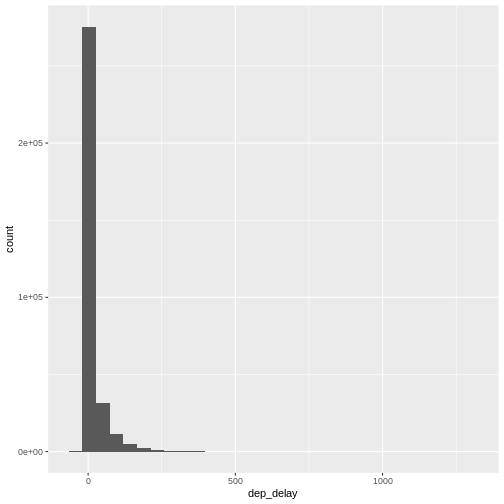
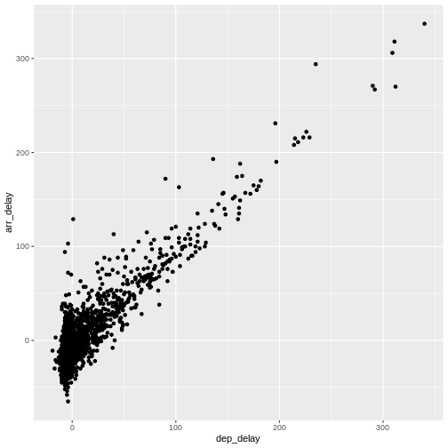
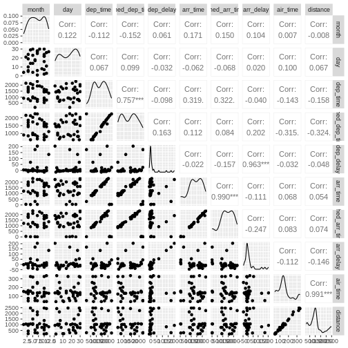

::::questions
- "How do I import data?"
- "How are the data distributed?"
- "Are there correlations between variables?"
::::

::::objectives
- "Importing data"
- "getting an overview of data"
- "how to find metadata"
- "using plots to explore our data"
::::


## Read in data in R

First we load `tidyverse` which make datamanipulation easier. We also load a 
package to help us read Excel files:

``` r
library(tidyverse)
library(readxl)
```

Let us read in the excel spreadsheet we downloaded in preparation, and saved
in the data folder of our project:


``` r
flightdata <- read_excel("data/flightdata.xlsx")
```


# Taking a look at the data

Always begin by taking a look at your data!


``` r
flightdata |> 
  head() |> 
  view()
```


This dataset is pretty big. It is actually so big, that a `view()` of the 
entire dataset takes about 10 seconds to render. And some of the other
things we would like to do to it, takes even longer.

Instead of waiting for that, it can be a good idea to work and experiment with
a smaller part of the dataset, and only use the entirety of the data when we 
know what we want to do.

One way of doing that would be to use the function `sample_frac` to return a
random fraction of the dataset:


``` r
flightdata |> 
  sample_frac(0.005) |> 
  view()
```

After taking a quick look at the data, it is time to get some
statistical insight.

The summary function returns summary statistics on our data:

``` r
summary(flightdata)
```

``` output
      year          month             day           dep_time    sched_dep_time
 Min.   :2013   Min.   : 1.000   Min.   : 1.00   Min.   :   1   Min.   : 106  
 1st Qu.:2013   1st Qu.: 4.000   1st Qu.: 8.00   1st Qu.: 907   1st Qu.: 906  
 Median :2013   Median : 7.000   Median :16.00   Median :1401   Median :1359  
 Mean   :2013   Mean   : 6.549   Mean   :15.71   Mean   :1349   Mean   :1344  
 3rd Qu.:2013   3rd Qu.:10.000   3rd Qu.:23.00   3rd Qu.:1744   3rd Qu.:1729  
 Max.   :2013   Max.   :12.000   Max.   :31.00   Max.   :2400   Max.   :2359  
                                                 NA's   :8255                 
   dep_delay          arr_time    sched_arr_time   arr_delay       
 Min.   : -43.00   Min.   :   1   Min.   :   1   Min.   : -86.000  
 1st Qu.:  -5.00   1st Qu.:1104   1st Qu.:1124   1st Qu.: -17.000  
 Median :  -2.00   Median :1535   Median :1556   Median :  -5.000  
 Mean   :  12.64   Mean   :1502   Mean   :1536   Mean   :   6.895  
 3rd Qu.:  11.00   3rd Qu.:1940   3rd Qu.:1945   3rd Qu.:  14.000  
 Max.   :1301.00   Max.   :2400   Max.   :2359   Max.   :1272.000  
 NA's   :8255      NA's   :8713                  NA's   :9430      
   carrier              flight       tailnum             origin         
 Length:336776      Min.   :   1   Length:336776      Length:336776     
 Class :character   1st Qu.: 553   Class :character   Class :character  
 Mode  :character   Median :1496   Mode  :character   Mode  :character  
                    Mean   :1972                                        
                    3rd Qu.:3465                                        
                    Max.   :8500                                        
                                                                        
     dest              air_time        distance         hour      
 Length:336776      Min.   : 20.0   Min.   :  17   Min.   : 1.00  
 Class :character   1st Qu.: 82.0   1st Qu.: 502   1st Qu.: 9.00  
 Mode  :character   Median :129.0   Median : 872   Median :13.00  
                    Mean   :150.7   Mean   :1040   Mean   :13.18  
                    3rd Qu.:192.0   3rd Qu.:1389   3rd Qu.:17.00  
                    Max.   :695.0   Max.   :4983   Max.   :23.00  
                    NA's   :9430                                  
     minute        time_hour                  
 Min.   : 0.00   Min.   :2013-01-01 10:00:00  
 1st Qu.: 8.00   1st Qu.:2013-04-04 17:00:00  
 Median :29.00   Median :2013-07-03 14:00:00  
 Mean   :26.23   Mean   :2013-07-03 09:22:54  
 3rd Qu.:44.00   3rd Qu.:2013-10-01 11:00:00  
 Max.   :59.00   Max.   :2014-01-01 04:00:00  
                                              
```
We get an overview of all the data (and the summary function have no problems
working with even very large datasets). From this we learn a bit about the 
datatypes in the data, and something about the distribution of the data. 

## Metadata

Metadata is data about the data. 
Usually we are interested in the provenance of the data. In this case it is
data on all flights departing New York City i 2013, from the three commercial
airports, JFK, LGA and EWR.
The data was originally extracted from the US Bureau of Transportation Statistics,
and can be found at https://www.transtats.bts.gov/Homepage.asp

The columns of the dataset contains the following data:

* year, month, day Date of departure.
* dep_time, arr_time Actual departure and arrival times (format HHMM or HMM), local tz.
* sched_dep_time, sched_arr_time Scheduled departure and arrival times (format HHMM or HMM), local tz.
* dep_delay, arr_delay Departure and arrival delays, in minutes. Negative times represent early departures/arrivals.
* carrier Two letter carrier abbreviation. See airlines to get name.
* flight Flight number.
* tailnum Plane tail number. See planes for additional metadata.
* origin, dest Origin and destination. See airports for additional metadata.
* air_time Amount of time spent in the air, in minutes.
* distance Distance between airports, in miles.
* hour, minute Time of scheduled departure broken into hour and minutes.
* time_hour Scheduled date and hour of the flight as a POSIXct date. Along with origin, can be used to join flights data to weather data.

Always remember to save information about what is actually in your 
data. 


## Let us make a plot

What is the distribution of departure delays? Are there a lot of flights that
depart on time, and a few that are very delayed?

A histogram is a great way to get a first impression of a particular variable
in the dataset, so let us make one of those:


``` r
flightdata |> 
  ggplot(mapping = aes(x = dep_delay)) +
    geom_histogram()
```

``` output
`stat_bin()` using `bins = 30`. Pick better value `binwidth`.
```

``` warning
Warning: Removed 8255 rows containing non-finite outside the scale range
(`stat_bin()`).
```


A histogram divides the numeric values of the departure delay into "buckets" 
with a fixed width. It then counts the number of observations in each 
bucket, and plot a column matching that count. 

Note the warning! By default `ggplot` divides the observations into 30 buckets.
30 buckets are almost never the right number, so adjust it by adding eg `bins = 50`
to `geom_histogram()`.

::::callout
## What is the right number of bins?

The right number of bins is the number of bins that show what
we want to show about the data. 


::::


## Let us make another plot!

After looking at the distrubtion of observations in the different variables, we might want to explore correlations between them.

What, for example, is the connection between delays of departure vs. arrival for these 
flights?


``` r
flightdata |> 
  sample_frac(.005) |> 
  ggplot(mapping = aes( x = dep_delay, y = arr_delay)) +
  geom_point()
```


We pipe the data to `sample_frac` in order to look at 0.5% of the data. 
The result of that is piped to the `ggplot` function, where we specify that 
the data should be `mapped` to the plot, by placing the values of the delay of 
departure on the X-axis, and the delay of arrival on the Y-axis. 

That in itself is not very interesting, so we add something to the plot:
`+ geom_point()`, specifying that we would like the data plotted as points.

This is an example of a case where it can be a good idea to work on a 
smaller dataset. Plotting the entirety of the data takes about 40 times
longer than plotting 0.5% of the data.

When we explore data, we often want to look at correlations in the data. 
If one variable falls, does another fall? Or rise?

Making these kinds of plots can help us identify interesting correlations, but
it is cumbersome to make a lot of them. So that can be automated.

The build-in `plot` function in R will take a dataframe, and plot each 
individual column against every other column. 

To illustrate this we cut down the dataset some more, looking at an even smaller
subset of the rows, and eliminating some of the columns. To get a better plot
without a lot of warnings, we also remove missing values from the dataset:


``` r
flightdata |> 
  na.omit() |> 
  sample_frac(.0001) |> 
  select(-c(year, carrier, flight, tailnum, hour, minute, time_hour, origin, dest)) |> 
  plot()
```


This gives us a good first indication of how the different variables varies 
together. The name of this type of plot is `correllogram` because it shows
all the correlations between the selected variables.

## Bringing distrubtion and correlation together

A better, or perhaps just prettier, way of doing the above is to use the library
`GGally`, which have a fancier version, showing both the distribution of values
in the different columns, but also the correlation between the variables.

Begin by installing `GGally`:

``` r
install.packages("GGally")
```

Now we can plot:


``` r
library(GGally)
flightdata |> 
  sample_frac(.0001) |> 
  select(-c(year, carrier, flight, tailnum, hour, minute, time_hour, origin, dest)) |> 
  na.omit() |> 
  ggpairs(progress = F)
```



We need to cut down the number of observations again - the scatterplots would
be unreadable otherwise. The classical corellogram is enriched with a densityplot
in the diagonal, basically a very smooth histogram, and the correlation coefficients
above the diagonal.


::::keypoints
- "Always start by looking at the data"
- "Always keep track of the metadata"
::::
